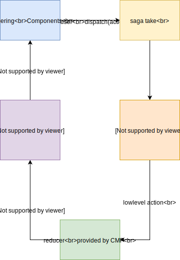

# React content management Framework

This is a framework to help you to build configurable React App.

It provides a set of base APIs and patterns.

[![Travis CI][travis-ci-image] ][travis-ci-url]
[![NPM][npm-icon] ][npm-url]
[![dependencies][dependencies-image] ][dependencies-url]
[![devdependencies][devdependencies-image] ][devdependencies-url]

[npm-icon]: https://img.shields.io/npm/v/@talend/react-cmf.svg
[npm-url]: https://npmjs.org/package/@talend/react-cmf
[travis-ci-image]: https://travis-ci.org/Talend/ui.svg?branch=master
[travis-ci-url]: https://travis-ci.org/Talend/ui
[dependencies-image]: https://david-dm.org/Talend/ui/status.svg?path=packages/cmf
[dependencies-url]: https://david-dm.org/Talend/ui?path=packages/cmf
[devdependencies-image]: https://david-dm.org/Talend/ui/dev-status.svg?path=packages/cmf
[devdependencies-url]: https://david-dm.org/Talend/ui?path=packages/cmf&type=dev

## Requirements

Before trying CMF you must know:

* [React](https://reactjs.org/)
* [Redux](https://redux.js.org/)
* [react-redux](https://redux.js.org/basics/usage-with-react)
* [redux-saga](https://redux-saga.js.org)
* [Immutable](https://facebook.github.io/immutable-js/)

You must understand all the following words: pure component, action creator, reducer, put, takeEvery, fromJS, ...

## What is react-cmf

It's a framework. It is the results of the years of experience with react ecosystem at Talend.
The goal is to provide one way to do the things keeping best pratices in mind.

## Working with react-cmf

If you tried to work with the required addons listed above you will do some
repetitive tasks and some boiler plate every time and on each components.

When working with a framework like angular you have the tools plus a guideline on how to use them.
With CMF the idea is the same. Provide the good set of tools plus the guideline.

To start a project using react-cmf you can use [bootstrap API](https://github.com/Talend/ui/tree/master/packages/cmf/src/bootstrap.md).

Working with react-cmf means:

* you write a set of configurable pure component connected using `cmfConnect`
* you configure them using the settings
* events are handled in a saga (effects are the way to write business code)



Side by side with angular 1:

* components are React *cmfConnected* (pure) component
* services are sagas
* controllers are containers

UI sends actions into redux which are handled by sagas.

## cmfConnect higher order component

`cmfConnect` create a component with all CMF features charged in it.
Under the hood it uses the connect function and create a container.

Once your component is connected:
* you can read data from the store using [expression](https://github.com/Talend/ui/tree/master/packages/cmf/src/expression.md)
* you can dispatch actions using [onEvent handler](https://github.com/Talend/ui/tree/master/packages/cmf/src/onEvent.md)


Read more about [cmfConnect](https://github.com/Talend/ui/tree/master/packages/cmf/src/cmfConnect.md)

## Store structure

CMF uses react-redux store with the following structure

* root
  * cmf
    * collections
    * components
    * settings

Collections and components use Immutable data structure.

### ComponentState Management

Component state can be easily stored in cmf state, each are identified by their name and an unique key,
so component state can be stored and reused later.

We give you the choice to use either:

* CMF redux state (this.props.state && this.props.setState)
* React component state (this.state && this.setState)

Warning: you should use the redux state except for part that require lots of mutation without sharing.
For example for Forms you should prefer to use the internal React component state.

### Collections management

Manage a local cache of your business data.
You can connect your component to give it access to your data and being able
to dispatch action to let CMF reducers write them.

You can dispatch some actionCreators in [api.actions.collections](https://github.com/Talend/ui/tree/master/packages/cmf/src/api.md) for that.

### Settings

We don't want to create a PR, merge, build to change a label of a button right?
With CMF you can describe all your app just using json.

The json looks like this:

```json
{
	"props": {
		"App#default": {
			"saga": "bootstrap"
		},
		"Navbar#default": {
			"brand": "Talend",
			"left": [{ "component": "Button", "componentId": "help" }]
		},
		"Button#help": {
			"id": "help",
			"label": "help",
			"payload": {
				"type": "MENU_HELP",
				"cmf": {
					"routerPush": "/help"
				}
			}
		}
	}
}
```

## Scripts

When you have cmf in you project, it adds [scripts](./scripts/index.md) in your node_modules/.bin

Tips you should add `node_modules/bin` folder into your path.

So you can use them either in CLI or in npm scripts.

## Tests & mocks

When you are in the context of CMF and you want to test your component you
will need to mock some stuff (context, ...).

We want testing experience to be easy so CMF provides some mocks for you.

```javascript
import React from 'react';
import renderer from 'react-test-renderer';
import { mock } from '@talend/react-cmf';

import MyComponent from './My.component';

const { Provider, store } = mock;

describe('App', () => {
	it('should render the app container', () => {
		const wrapper = renderer
			.create(
				<Provider>
					<MyComponent />
				</Provider>,
			)
			.toJSON();
		expect(wrapper).toMatchSnapshot();
	});
});
```

This way MyComponent may request for the following context:

* registry
* store

you may change the following using simple props:

* store
* state
* registry

## More

* [App](https://github.com/Talend/ui/tree/master/packages/cmf/src/App.md)
* [cmfConnect](https://github.com/Talend/ui/tree/master/packages/cmf/src/cmfConnect.md)
* [settings](https://github.com/Talend/ui/tree/master/packages/cmf/src/settings.md)
* [api](https://github.com/Talend/ui/tree/master/packages/cmf/src/api.md)
* [store](https://github.com/Talend/ui/tree/master/packages/cmf/src/store.md)
* [Dispatcher](https://github.com/Talend/ui/tree/master/packages/cmf/src/Dispatcher.md)
* [how to](howto/index.md)
* [sagas](https://github.com/Talend/ui/tree/master/packages/cmf/src/sagas/index.md)
* [sagaRouter](https://github.com/Talend/ui/tree/master/packages/router/src/sagaRouter.md)
* [scripts](scripts/index.md)

## Internals

* [registry](https://github.com/Talend/ui/tree/master/packages/cmf/src/registry.md).
* [middleware/cmf](https://github.com/Talend/ui/tree/master/packages/cmf/src/middlewares/cmf/index.md)
* [middleware/http](https://github.com/Talend/ui/tree/master/packages/cmf/src/middlewares/http/index.md)
