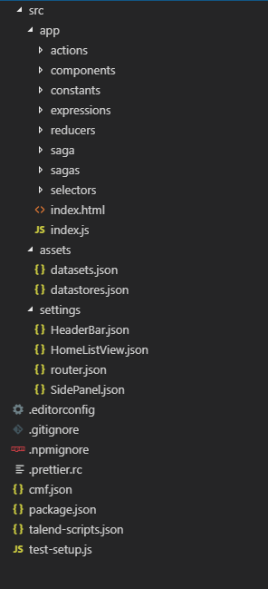

The easiest way to start with CMF is to use the [Yeoman](http://yeoman.io/) generator.

## Install the generator

```bash

$> npm install -g yo
$> npm install -g @talend/generator-talend

```

or

```bash

$> yarn global add yo
$> yarn global add @talend/generator-talend

```

## Generate your project

```bash

$> yo talend:react-cmf

     _-----_
    |       |    ╭──────────────────────────╮
    |--(o)--|    │ Welcome to the react-cmf │
   `---------´   │      app generator!      │
    ( _´U`_ )    ╰──────────────────────────╯
    /___A___\   /
     |  ~  |
   __'.___.'__
 ´   `  |° ´ Y `

$> name my-app-name
$> description My App using the amazing React CMF

```

Yeoman will create a base project with an example.

To serve the example project on http://localhost:8080/, run

```bash

$> npm start

```

or

```bash

$> yarn start

```

## Project structure



`/assets` contains your assets (images, ...)<br />
`/settings` contains your settings files<br />
`/app` contains the javascript app
`/app/actions` contains your app action creators<br />
`/app/components` contains your app components<br />
`/app/constants` contains your app constants (redux actions types, ...)<br />
`/app/expressions` contains your app expressions (redux actions types, ...)<br />
`/app/reducers` contains your app reducers<br />
`/app/saga` contains the main saga attached to the app lifecycle<br />
`/app/sagas` contains sagas attached to component lifecycle<br />
`/app/selectors` contains redux selectors<br />
`/app/index.js` is your app bootstrap<br />

## App entry point

Open `index.js`, you'll see

```javascript

/**
 * Import theme.
 * Being the first import is important, so that it is the default style
 * and other style can override it
 */
import 'bootstrap-talend-theme/src/theme/theme.scss';
import React from 'react';
import cmf from '@talend/react-cmf';

import actions from './actions';
import components from './components';
import reducer from './reducers';

cmf.bootstrap({
  appId: 'app',
  actions,
  components,
  reducer,
  settingsURL: '/settings.json',
});

```

It basically will

1.  Register `components`, `actions creators` in CMF for DI.
2.  Setup react-redux store.
3.  Load the CMF [settings](https://github.com/Talend/ui/tree/master/packages/cmf/src/settings.md)
4.  Call react-dom.render function on appId html element.

## Let's go through a feature

In this part, we'll go through the code allowing to display the list of datastores (entities).

**1. settings/routes.json**

```json

{
  "routes": {
    "path": "/",
    "component": "App",
    "childRoutes": [
      {
        "path": "datastores",
        "component": "HomeListView",
        "componentId": "datastores"
      }
    ]
  }
}

```

The url http: will display the `` container, passing the props ``.
The HomeListView will try to find `` in settings:

```json


```

The `` settings has props that refer to an action ``.

**2. app/actions/datastores.js**

```javascript


```

This action creator uses the [http](https://github.com/Talend/ui/tree/master/packages/cmf/src/middlewares/http/index.md) utility and middleware to

-   perform the GET request
-   orchestrate the requests steps actions dispatch
-   store the resulting collection in ``

**4. HomeListView container**

`` container is from [react-talend-containers](https://github.com/Talend/ui/tree/master/packages/containers).

-   it map from the state its `` as props
-   it is connected to the redux store to get the collection in ``
-   it uses internal action API to resolve the `` action.
