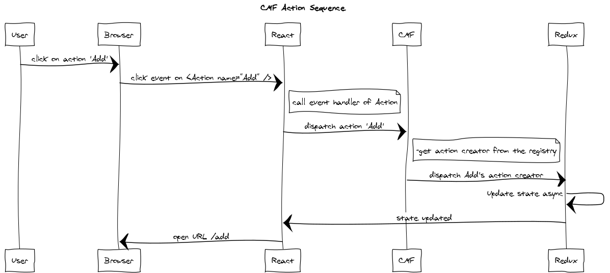

CMF stands for Content Management Framework. It helps you to build an application in React with a system to configure your contents and much more.

It combines
* [React](https://reactjs.org)
* [Redux](https://redux.js.org/)

Based on a `component / action creator` registry and a `settings` format, you configure your entire app
* the routes
* which component to load on a route
* which props to pass to this component to load
* which action is dispatched

## The core concepts
* [Registry](./core-registry.md) : CMF has a registry where you can set `components` and `action creators`
* [Settings](./core-settings.md) : this is used to configure your app content, customising the `routes` (url, components), `props` and static `actions`.

## How CMF works

*Registry*
* Register your `components` with unique names.
* Register your `action creators` with unique names.

*Settings*
* Settings > routes map `urls` to registered `components` names and `componentId` settings names.
* Settings > props contains the `components` props.

*Bootstrap and runtime*

* Bootstrap your app with the provided `<App />` component
* CMF instantiates the right component on a requested route, injecting the props

## Extra features

CMF comes with handy features
* Error redux `middleware` [Doc](https://github.com/Talend/ui/tree/master/packages/cmf/src/middlewares/error/index.md).
* HTTP operations `actions` and redux `middleware` [Doc](https://github.com/Talend/ui/tree/master/packages/cmf/src/middlewares/http/index.md).
* CMF internal `middleware` [Doc](https://github.com/Talend/ui/tree/master/packages/cmf/src/middlewares/cmf/index.md).
* Actions utility to get and configure easily the `action creators` [Doc](./api-action).
