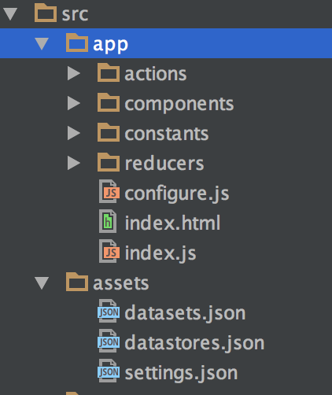

# Getting started

The easiest way to start with CMF is to use the [Yeoman](http://yeoman.io/) generator.

## Install the generator

```bash
> npm install -g yo
> npm install -g generator-talend
```

## Generate your project

```bash
> yo talend:react-cmf

     _-----_
    |       |    ╭──────────────────────────╮
    |--(o)--|    │ Welcome to the react-cmf │
   `---------´   │      app generator!      │
    ( _´U`_ )    ╰──────────────────────────╯
    /___A___\   /
     |  ~  |
   __'.___.'__
 ´   `  |° ´ Y `

> name my-app-name
> description My App using the amazing React CMF
```

Yeoman will create a base project with an example.

To serve the example project on http://localhost:8080/, run

```bash
> npm start
```

## Project structure



`/assets` contains your assets (images, static settings, ...)<br>
`/app/actions` contains your app action creators<br>
`/app/components` contains your app components<br>
`/app/constants` contains your app constants (redux actions types, ...)<br>
`/app/reducers` contains your app reducers<br>
`configure.js` is your app configuration before bootstrap<br>

## App entry point

Open `index.js`, you'll see

```javascript
/**
 * Import theme.
 * Being the first import is important, so that it is the default style
 * and other style can override it
 */
import 'bootstrap-talend-theme/src/theme/theme.scss';
import React from 'react';
import { render } from 'react-dom';
import { App, store as cmfstore, actions } from 'react-cmf';
import { browserHistory } from 'react-router';
import { routerMiddleware, syncHistoryWithStore } from 'react-router-redux';

import configure from './configure';
import appReducer from './reducers';

/**
 * Initialize CMF configuration
 * - Register your components in the CMF dictionary
 * - Register action creators in CMF actions dictionary
 */
configure.initialize();

/**
 * Register react-router-redux router reducer (see https://github.com/reactjs/react-router-redux)
 */
cmfstore.setRouterMiddleware(routerMiddleware(browserHistory));

/**
 * Register your app reducers
 */
const store = cmfstore.initialize(appReducer);

/**
 * Fetch the CMF settings and configure the CMF app
 */
store.dispatch(actions.settingsActions.fetchSettings('/settings.json'));

/**
 * Render the CMF App
 */
render(
	<App store={store} history={syncHistoryWithStore(browserHistory, store)} />,
	document.getElementById('app')
);
```

It basically
1. Register `components` and `actions creators` in CMF

```javascript
configure.initialize();
```

2. Initialize the CMF [store](../src/store.md) based on [redux](http://redux.js.org/)

```javascript
cmfstore.setRouterMiddleware(routerMiddleware(browserHistory));
const store = cmfstore.initialize(appReducer);
```

3. Load the CMF [settings](../src/settings.md)
```javascript
store.dispatch(actions.settingsActions.fetchSettings('/settings.json'));
```

4. Bootstrap the app using the CMF [App component](../src/App.md)

```javascript
render(
	<App store={store} history={syncHistoryWithStore(browserHistory, store)} />,
	document.getElementById('app')
);
```

## Let's go through a feature

In this part, we'll go through the code allowing to display the list of datastore.

**1. assets/settings.json**
```json
{
  ...

  "routes": {
    "path": "/",
    "component": "App",
    ...
    "childRoutes": [
      ...
      {
        "path": "datastores",
        "component": "HomeListView",
        "view": "datastores"
      }
    ]
  },

  ...
}
```

The url http://localhost:8080/datastores will display the `HomeListView` container, passing the `datastores` views settings as props.

```json
{
  ...

  "views": {
    ...

    "datastores": {
      "didMountActionCreator": "datastore:fetchAll",
      ...
    },

    ...
  },

  ...
}
```

The `datastores` views settings has a props that refers to an action `datastore:fetchAll`.

**2. app/configure.js**

In the app configuration, we register `HomeListView` container and the `datastore:fetchAll` action creator.

```javascript
	initialize() {
		registerComponent('HomeListView', HomeListView);

		...

		registerActionCreator('datastore:fetchAll', fetchDataStores);
	},
```

**3. app/actions/datastore.js**

```javascript
export function fetchDataStores() {
	/**
	 * CMF actions.http is an action creator that will dispatch an http action.
	 * This action will be caught and executed by the CMF http middleware
	 */
	return actions.http.get('/datastores.json', {
		// action type to dispatch before fetch
		onSend: GETTING_DATASTORES,
		// action type to dispatch on fetch error
		onError: ERROR_GETTING_DATASTORES,
		// CMF action config
		// collectionId is the key where the result will be stored in app state
		cmf: {
			collectionId: 'datastores',
		},
	});
}
```

This action creator uses the [http](../src/middlewares/http/index.md) utility and middleware to
* perform the GET request
* orchestrate the requests steps actions dispatch
* store the resulting collection in `state.cmf.collections.datastores`

**4. HomeListView container**

`HomeListView` container is from [react-talend-containers](https://github.com/Talend/ui/tree/master/packages/containers).
* it receives the `datastores views settings` as props
* it is connected to the redux store to get the collection in `state.cmf.collections.datastores`
* it uses the [actions utility]({{ site.baseurl }}) to resolve the `datastore:fetchAll` action.

## Next steps

To go further, explore the `core concept` and [How to add a new page ?](how-to-add-a-new-page.md)
