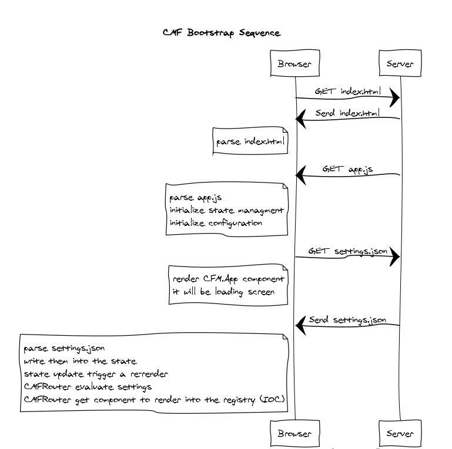
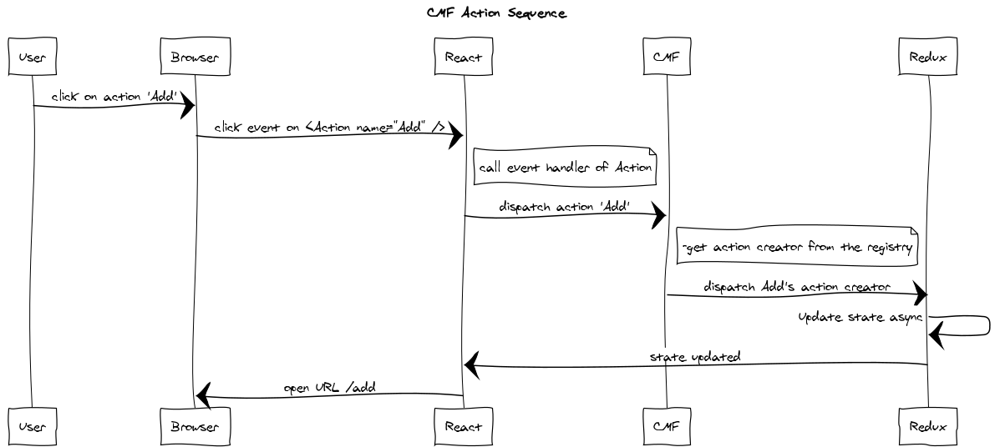

CMF is a framework to helps you to build an application in React with a system to configure your components and much more.

It combines
* [React](https://reactjs.org)
* [Redux](https://redux.js.org/)
* [Saga](https://redux-saga.js.org)

Based on a `component / action creator` registry and a `settings` format, you configure your entire app
* the routes
* which component to load on a route
* which props to pass to this component to load
* which action is dispatched

## The core concepts
* [Registry](./core-registry.md) : CMF has a registry where you can set `components` and `action creators`
* [Settings](./core-settings.md) : this is used to configure your app content, customising the `routes` (url, components), `props` and static `actions`.

## How CMF works

*Registry*
* Register your `components` with unique names.
* Register your `action creators` with unique names.

*Settings*
* Settings > routes map `urls` to registered `components` names and `componentId` settings names.
* Settings > props contains the `components` props.

*Bootstrap and runtime*

* Bootstrap will fill the registry and configure all addons
* Then it will then render the `RootComponent` into the DOM

A typical user interaction will look like this:

