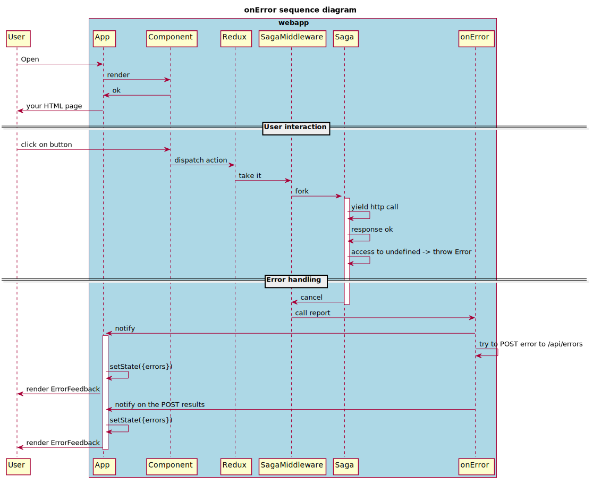

# onError

Error handling is a sensible topic and it is so important.
When an issue happens in an app and it has not been caught we need a lots of information to be able to understand it and debug it.

## User experience

What facebook says:

```
it is worse to leave corrupted UI in place than to completely remove it
```

source: https://reactjs.org/docs/error-boundaries.html#new-behavior-for-uncaught-errors

So we must inform the end user and give few options.

Without an available backend to post it we propose the following options to the user:

* `refresh` to reload the app
* `download report` to get the complete context when the error happens

With a backend available we post the information automatically to it and let the user choose between

* `refresh` to reload the app
* `contact the support` with a given `id`

As a company you must aggregate those errors and be notified from it.
An error for a end user means frustration so they should be treated as soon as possible.

But where react delegates the handler error we will give a solution: notify the user and try to report it automatically.

## Technical point of view

Before we continue, please be sure you have read and understood the following documentation

* [Error Handling in React 16](https://reactjs.org/blog/2017/07/26/error-handling-in-react-16.html)
* [Global Event Handlers onerror](https://developer.mozilla.org/en-US/docs/Web/API/GlobalEventHandlers/onerror)
* [online and offline events](https://developer.mozilla.org/en-US/docs/Web/API/NavigatorOnLine/Online_and_offline_events)

When an error occurs during rendering, we fallback on an `ErrorFeedback` component. The worse situation may happens if this component fall in error.

When an error occurs, we dispatch an action.



## API (without external service)

To configure error handling (bootstrap > onError) please refer to the [bootstrap documentation](./bootstrap.md#onError)

CMF will post to the backend the following data structure:

| attribute  | example value                                                                                                               | description                           |
| ---------- | --------------------------------------------------------------------------------------------------------------------------- | ------------------------------------- |
| `time`     | "2018-11-16T09:51:44.500Z"                                                                                                  | the current date time                 |
| `browser`  | "Mozilla/5.0 (Macintosh; Intel Mac OS X 10_13_6) AppleWebKit/537.36 (KHTML, like Gecko) Chrome/70.0.3538.102 Safari/537.36" | navigator.userAgent                   |
| `location` | https://www.myapp.com/path/#/hash                                                                                           | the location.href                     |
| `error`    | { message, name , stack }                                                                                                   | the fields we have found in the error |
| `actions`  | [ 'REDUX_ACTION_TYPE']                                                                                          | last actions                          |

A component named ErrorBoundary is exposed and already used at the App level, so you can use it
in your own components in some key places.

```javascript
import { ErrorBoundary } from '@talend/react-cmf';

function DoComplexComponent(props) {
    // ... do some stuff
}

export function ComplexComponent(props) {
    return (
        <ErrorBounday>
            <DoComplexComponent {...props} />
        </ErrorBounday>
    );
}
```

# Sentry

If you have Sentry in your infrastructure you can add the following settings.

```json
{
	"env": {
		"SENTRY_DSN": "$SENTRY_DSN"
	}
}
```

If you have an other way to get the DSN you can use it in the bootstrap onError using the same key `SENTRY_DSN`.

```javascript
fetch('/api/webapp-config').then(config => {
	cmf.bootstrap({
		...
		onError: {
			SENTRY_DSN: config.SENTRY_DSN
		}
	});
})
```

Note: to be compliant with [12 factors](https://12factor.net) the DSN must be read from a server environment variable.