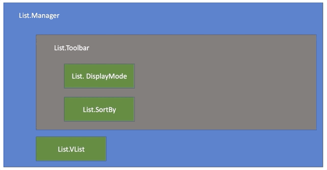
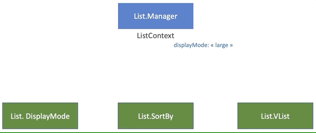
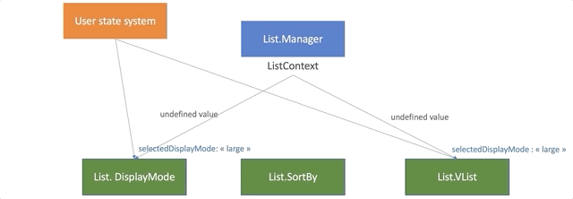

# Developer guide

## Principle

Let's take this jsx that represents what we want to write

```javascript
<List.Manager
    id="my-list"
    collection={ [{ id: 0 }, { id: 1 }, { id: 2 }, { id: 3 }]}
>
    <List.Toolbar>
        <List.DisplayMode id="my-list-displayMode"  />
        <List.SortBy id="my-list-sortBy" />
    </List.Toolbar>

    <List.VList>
       <List.VList.Content label="Id" dataKey="id" />
       <List.VList.Content label="Name" dataKey="name" />
   </List.VList>
</List.Manager>
```

In this example we have 2 features: display mode and sort selection. In those 2 features we need to share info.

For display mode
* VList display mode must reflect DisplayMode widget value
* DisplayMode widget must propagate changes
* There is synchronisation

For sort
* In Table mode
  * VList displays the sort caret in the headers
  * VList must propagate sort new values on headers click
* In Large mode
  * VList must display the Sort widget value
  * Sort widget must propagate changes
* The switch between each mode must keep the sort values. So there is synchronisation.

**TL;DR**
This synchronisation will be through React context.



Let's see how we can add a feature, with shared info between List widgets that fits this system.


## ListManager

ListManager holds the state as the single source of truth in uncontrolled mode.

Any synchronized value and its setter are exposed via React context.

```diff
import React, { useState } from 'react';
import ListContext from '../context';

function ListManager(props) {
    // existing states

+   // 1 - Add the new state
+   const [displayMode, setDisplayMode] = useState();

    const contextValue = {
        // other state and setters

+       // 2 - Add the new state and setter in context value
+       displayMode,
+       setDisplayMode,
    };

    return <ListContext.Provider value={contextValue}>{props.children}</ListContext.Provider>;
}
```


## List widgets

The widgets use the context to get the values and setters they need.

```javascript
import React, { useContext } from 'react';
import ListContext from '../context';

function ListDisplayMode(props) {
    const { displayMode, setDisplayMode } = useContext(ListContext);

    // do whatever we want, including
    // * set displayMode as selected display mode
    // * call setDisplayMode on change
}
```

Even simpler for widgets that only need to use the synchronized value.

```javascript
import React, { useContext } from 'react';
import ListContext from '../context';

function VList(props) {
    const { displayMode } = useContext(ListContext);

    // use the displayMode
}
```



### Let's avoid the mistakes we made

**Rule**

It's important to keep the api that concerns the feature in the feature's widget. Avoid passing all the things to ListManager props.
For example, any prop to manage the DisplayMode must be set in ListDisplayMode.

**Why ?**

Simply to avoid the apropcalypse we have today with the List component.
Scoping the api of the feature makes it simpler to manage, and keep each widget api minimalist.

**Example**

```diff
<List.Manager
    id="my-list"
    collection={collection}
-   initialDisplayMode="table"
>
    <List.Toolbar>
        <List.DisplayMode
            id="my-list-displayMode"
+           initialDisplayMode="table"
         />
    </List.Toolbar>

    <List.VList></List.VList>
</List.Container>
```

Let's see how. But first we need to know what is a controlled/uncontrolled component.

### Controlled vs uncontrolled

A controlled component is equivalent to a presentational component. It takes values an from props, and doesn't hold a state. The source of truth is from props.
It means user has to manage the state himself.

```javascript
function ControlledInput({ value, onChange }) {
    // It doesn't hold a state, it only renders the value from props.
    // On change, the new value is not rendered, unless it is reinjected as props
    return <input value={value} onChange={onChange} />;
}
```


An uncontrolled component has its own state. The value is then propagated at some event.

```javascript
function UncontrolledInput({ onChange }) {
    // The state is in the DOM.
    // Any change appears in the input automatically.
    // The value is propagated via onChange, that can take the value from event.target.value
    return <input onChange={onChange} />
}
```


### Uncontrolled mode

By default, using only the ListManager context as only value and setter makes your component work in uncontrolled mode.
Writing minimal code makes it work internally.

```javascript
<List.Manager id="my-list" collection={collection}>
    <List.Toolbar>
        <List.DisplayMode id="my-list-displayMode"  />
    </List.Toolbar>

    <List.VList></List.VList>
</List.Container>
```

In this example, any change in ListDisplayMode propagates via the ListManager, and the 2 widgets (ListDisplayMode and VList) use the same value from ListContext.


Now let's add the possibility to set an initial value in uncontrolled mode. As seen before, we must keep the api in ListDisplayMode to avoid a ListManager apropcalypse.
```diff
<List.Manager id="my-list" collection={collection}>
    <List.Toolbar>
        <List.DisplayMode
            id="my-list-displayMode"
+           initialDisplayMode="large"
/>
    </List.Toolbar>

    <List.VList></List.VList>
</List.Container>
```

What we need to do is propagate this initial value to synchronize it to other components only once, on component mount.
Then the context system will make this value evolve internally.

```javascript
import React, { useContext } from 'react';
import ListContext from '../context';

function ListDisplayMode(props) {
    const { displayMode, setDisplayMode } = useContext(ListContext);

    useEffect(() => {
        setDisplayMode(props.initialDisplayMode);
    }, []);
}
```


### Controlled mode

Controlled mode basically replaces the internal ListContext mode by user own system.



What we want to write ? Again, it must be managed by ListDisplayMode to avoid the List apropcalypse.

```diff
<List.Manager id="my-list" collection={collection}>
    <List.Toolbar>
        <List.DisplayMode
            id="my-list-displayMode"
+           selectedDisplayMode={valueFromMyAppStateSystem}
+           onChange={(event, value) => changeInMyAppStateSystem(event, value)}
/>
    </List.Toolbar>

-   <List.VList>
+   <List.VList type={valueFromMyAppStateSystem}>
    </List.VList>
</List.Container>
```

In the implementation, we just need the props (value, setter) to be a priority over context (value, setter).
So the value never evolve internally, it's the user state system that will reinject the value to each widgets.

```javascript
import React, { useContext } from 'react';
import ListContext from '../context';

function ListDisplayMode(props) {
    const { displayMode, setDisplayMode } = useContext(ListContext);
    const { selectedDisplayMode, onChange } = props;

    // if we have selectedDisplayMode/onChange : controlled mode, we use props (selectedDisplayMode, onChange)
    // otherwise : uncontrolled mode, we use context (displayMode, setDisplayMode)
}
```


## Summary

1. Use the ListManager + ListContext to set and propagate the info to all the List widgets
2. The list widgets must manage their own props for controlled mode
3. The list widgets takes props as priority (controlled mode), then context if props are undefined (uncontrolled mode)
