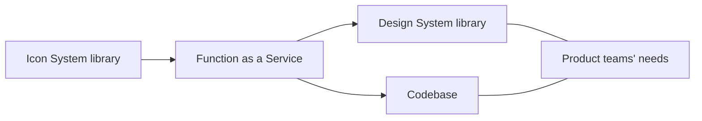

# Icon provider

## Context

Icon provider deserves fresh new behaviors, to serve the icons, because:

* We serve icons as they are exported, in their non-optimized version.
* There are no strong types definitions for the icons.
* The icons we see in Figma high fidelity mockups and the icons we get in production can differ.
* We can't update icon's parts unitary and reuse shapes for composition purposes since they are flattened.

## Problem

Icons need to be hosted by Figma because they rely on many shapes, like atoms, in a systemic way. 
That's our Icon System.
Having such a dedicated NPM package should only be the result of an optimization of those icons.
In the meantime, Figma high-fidelity mockups must use the same optimized icons to inherit the current color, the consequence of that optimization too.

## Solution

Figma will stay the single source of truth.
Figma will host the raw version, including the whole stack of shapes for each icon. 
Those shapes will be based on the predefined atoms and will follow our guidelines for some consistency reasons.

Figma will expose the optimized version of those icons, on their own, as components.
These components will be used by our product designers to compose the hi-fi mockups.

GitHub will get the icons from Figma and expose them as React components using TypeScript.
The NPM package will include each SVG icon, with each size variation, and will be exposed through Amazon CloudFront.

Since icons are not really critical, it's time to serve them in the smartest way.
Instead of fetching the whole SVG sprite, even if it's put in the cache, we can benefit of our current CDN architecture to push forward the limits.
The goal is to introduce the usage of [service worker for a caching strategy](https://serviceworke.rs/strategy-cache-and-update.html).

The first time you hit the icon, we will fetch it on the CDN.
Next time, you will get the cached version and it will be updated in the background for the next calls. 
