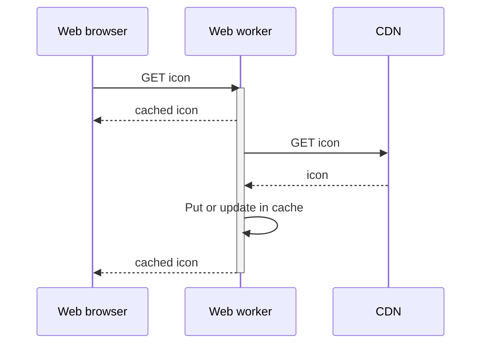

# Icon provider

## Context

Icon provider needs a fresh new behavior to serve the icon as fast as it can.

## Problem

Icons need to be hosted by Figma because they rely on many shapes, as atoms, in a systemic way.
Having such decicated NPM package should only be the result of an optimization of those icons.

In the meantime, Figma high-fidelity mockups must use the same optimized icons to inherit of the current color.

## Solution

Since icons are not really critical, it's time to serve them in a smartest way.
Instead of fetching the whole SVG sprite, again and again, we can befenit of our current CDN architecture to push forward the limits.
The goal is to introduce the usage of web worker for a caching strategy.

First time you hit the icon, we will fetch it on the CDN.
Next times, you will get the cached version and it will be updated in background for the next calls. 
