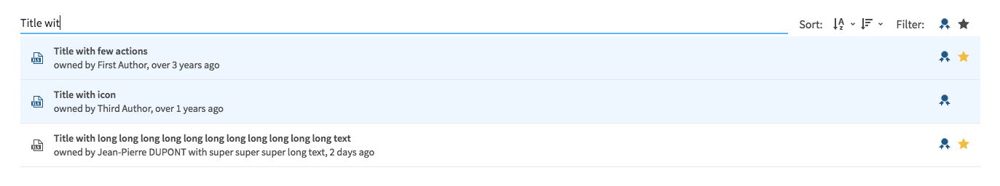

# ResourcePicker

This widget allows you to render a resource picker to select one or multiple resources.

**Json Schema**

| Property | Description |
|---|---|
| type | `string` |


```json
{
    "type": "object",
    "title": "ResourcePicker",
    "properties": {
      "multiResourcePicker": {
        "type": "enum",
        "enum": []
      },
      "singleResourcePicker": {
        "type": "enum",
        "enum": []
      }
    }
}
```

**UI Schema**

| Property | Description | Default |
|---|---|---|
| multi | Allow multiselection | `false` |
| title | The title to display next to the field |  |
| widget | The widget to use | `resourcePicker` |
| filters | An array of the filter we want to display, possible values : ["certified", "selection", "favorites"] |
| sort | An array of the sortable field, possible values : ["name", "date"] |

```json
[
    {
      "key": "multiResourcePicker",
      "title": "ResourcePicker with multi selection",
      "widget": "resourcePicker",
      "placeholder": "Select an existing resource",
      "required": true,
      "multi": true
    },
  ]
```


**Triggers**

Two kind of events are supported :

- change : triggered when the selected item changes
- filter : triggered when something has changed in the filter bar


```json
[
    {
        "key": "datasetId",
        "title": "ResourcePicker that changes the input above",
        "placeholder": "Select an existing resource",
        "widget": "resourcePicker",
        "triggers": [
            { "action": "resourcePickerSelected", "onEvent": "change" },
            { "action": "resourcePickerFiltered", "onEvent": "filter" }
        ],
        "multi": false
    }
],
```


```javascript
if (payload.trigger.onEvent === 'filter') {
    // filter, call your backend, or do whatever you want, but at the end return a promise :
    return Promise.resolve({
        collection // the filtered collection
    });
}
if (payload.trigger.onEvent === 'change') {
    return Promise.resolve({
        properties: properties => {
            const { datasetId, name } = properties;
            return (name && name.length) ? properties : {
                ...properties,
                anything: 'custom value',
            };
        },
        errors: errors => {
            // from this point you have to manage the validation on the field you've modified,
            // so because you just set a value, we can admit that this value is valid
            // => you can delete the errors on this field
            const e = { ...errors };
            delete e.anything;
            return e;
        },
    });
}
```

**Result**


