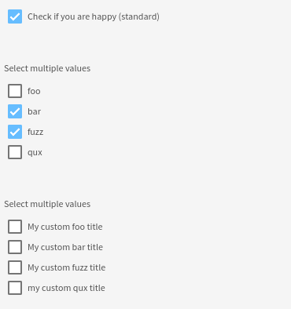

# Checkboxes

This widget allows you to render checkboxes input.

**Json Schema**

| Property for single checkbox | Description |
|---|---|
| type | "boolean" |

| Property for multiple checkboxes | Description |
|---|---|
| type | "array" |
| items.type | Type of the items |
| items.enum | Possible values |

```json
{
  "type": "object",
  "title": "Booleans",
  "properties": {
    "standard": {
      "type": "boolean"
    },
    "multipleChoices": {
      "type": "array",
      "items": {
        "type": "string",
        "enum": [
          "foo",
          "bar",
          "fuzz",
          "qux"
        ]
      }
    },
    "customMultipleChoices": {
      "type": "array",
      "items": {
        "type": "string",
        "enum": [
          "foo",
          "bar",
          "fuzz",
          "qux"
        ]
      }
    }
  }
}
```

**UI Schema**

| Property | Description |
|---|---|
| title | The title to display above field |
| autoFocus | Default: false |
| disabled | Default: false |
| titleMap | A mapping of value/label to display |

```json
[
  {
    "key": "standard",
    "title": "Check if you are happy (standard)"
  },
  {
    "key": "multipleChoices",
    "title": "Select multiple values"
  },
  {
    "key": "customMultipleChoices",
    "title": "Select multiple values",
    "titleMap": {
      "foo": "My custom foo title",
      "bar": "My custom bar title",
      "fuzz": "My custom fuzz title",
      "qux": "my custom qux title"
    }
  }
]
```

**Result**


