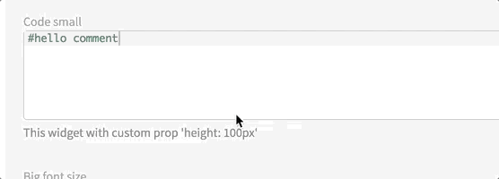

# Code

This widget allows you to render an ace-editor within a form.

**Json Schema**

| Property | Description |
|---|---|
| type | `string` |

```json
{
  "type": "object",
  "title": "Code form",
  "properties": {
    "myPythonCode": {
      "type": "string"
    }
  }
}
```

**UI Schema**

| Property | Description | Default |
|---|---|---|
| autoFocus | Focus on input on render | `false` |
| disabled | Disable the input | `false` |
| options | Object that is spread as [react-ace props](https://github.com/securingsincity/react-ace/blob/master/docs/Ace.md). |  |
| readOnly | Set the input as non modifiable | `false` |
| title | The title to display above editor |  |
| widget | `code` | `code` |

```json
[
  {
    "key": "myPythonCode",
    "widget": "code",
    "title": "Last name",
    "autoFocus": false,
    "disabled": false,
    "readOnly": false,
    "options": {
	  "language": "python",
	  "height": "200px"
    }
  }
]
```

**Result**


