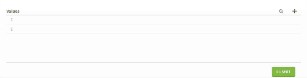

# Enumeration

This widget allows you to render a Enumeration to add/search/edit/remove lists of values.

**Json Schema**

| Property | Description |
|---|---|
| type | `array` |
| items.type | The type of array items |
| items.values | The array of values |


```json
{
  "type": "object",
  "title": "Enumeration",
  "properties": {
    "dictionary": {
      "type": "array",
      "items": {
        "type": "object",
        "properties": {
          "values": {
            "type": "array",
            "items": {
              "type": "string"
            }
          }
        }

      }
    }
  }
}
```

**UI Schema**

| Property | Description | Default |
|---|---|---|
| allowDuplicate | If duplicate values are allowed | `false` |
| allowImport | iF import is allowed | `false` |
| data-feature | data-feature values for importFile, addFromFile, overwriteExisting | `undefined` |
| widget | The widget to use | `enumeration` |

```json
[
    {
      "key": "dictionary.items",
      "widget": "enumeration"
    }
  ]
```

**Result**


