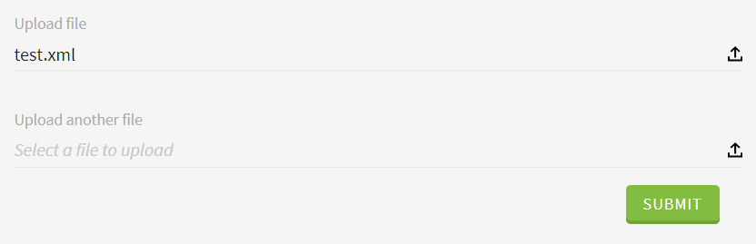

# File

This widget allows you to render a file input.

**Json Schema**

| Property | Description |
|---|---|

```json
{
  "type": "object",
  "title": "File",
  "properties": {
    "file": {
      "type": "text"
    }
  }
}
```

**UI Schema**

| Property | Description | Default |
|---|---|---|
| widget | `file` | `file` |
| title | The title to display above field |  |
| accept | File type specifier list to allow | |
| autoFocus | Focus on input on render | `false` |
| disabled | Disable the input | `false` |
| placeholder | Text to display as placeholder |  |
| readOnly | Set the input as non modifiable | `false` |
| triggers | List of trigger types |

```json
[
  {
    "key": "file",
    "widget": "file",
    "title": "Upload file",
    "accept": ".csv, application/vnd.openxmlformats-officedocument.spreadsheetml.sheet, application/vnd.ms-excel",
    "autoFocus": false,
    "disabled": false,
    "placeholder": "Select a file to upload",
    "readOnly": false,
    "triggers": [
      { "action": "generatePresignedURL", "onEvent": "change" }
    ]
  }
]
```

**Result**


