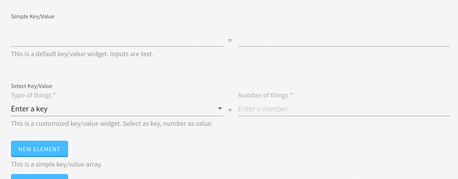

# KeyValue

This widget allows you to render a key/value pair of inputs.

**Json Schema**

| Property | Description |
|---|---|
| type | `object` |
| properties.key | Optional. It allows to configure the `key` jsonSchema. If not provided, a default text input will be rendered. |
| properties.value | Optional. It allows to configure the `value` jsonSchema. If not provided, a default text input will be rendered. |
| required | You can pass `key` and/or `value` string, to make them mandatory. Note that this is only valid if the mandatory fields have a proper json schema configuration (default configurations stay not mandatory) |

Simple configuration
```json
{
  "type": "object",
  "title": "Key/Value",
  "properties": {
    "simpleKeyValue": { "type": "object" }
  }
}
```

Advanced configuration
```json
{
  "advancedKeyValue": {
    "type": "object",
    "properties": {
      "key": {
        "type": "string",
        "enum": [
          "foo",
          "bar",
          "fuzz",
          "qux"
        ]
      },
      "value": { "type": "number" }
    },
    "required": ["key"]
  }
}
```

**UI Schema**

| Property | Description | Default |
|---|---|---|
| autoFocus | If the key/value should has autoFocus | `false` |
| description | A description to display below the widget |  |
| disabled | Disable the inputs | `false` |
| items | Configure the key/value uiSchema |  |
| readOnly | If the inputs should be readonly | `false` |
| title | The title to display on top of the widget |  |
| widget | The widget to use | `keyValue` |

Simple configuration
```json
[
    {
      "key": "simpleKeyValue",
      "description": "This is a default key/value widget. Inputs are text.",
      "title": "Simple Key/Value",
      "widget": "keyValue"
    }
  ]
```

Advanced configuration
```json
[
    {
      "key": "advancedKeyValue",
      "description": "This is a customized key/value widget. Select as key, number as value.",
      "items": [
        {
          "key": "advancedKeyValue.key",
          "placeholder": "Enter a key",
          "title": "Type of things *",
          "titleMap": {
            "foo": "The foo option",
            "bar": "The bar option",
            "fuzz": "The fuzz option",
            "qux": "The qux option"
          },
          "widget": "select"
        },
        {
          "key": "advancedKeyValue.value",
          "placeholder": "Enter a number",
          "title": "Number of things *"
        }
      ],
      "title": "Select Key/Value",
      "widget": "keyValue"
    }
  ]
```

**Result**


