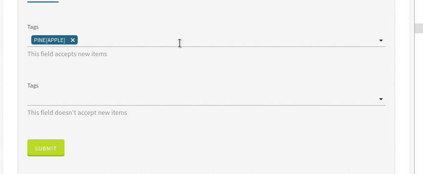

# MultiSelectTag

This widget allows you to render a Typeahead to add multiple tags.

**Json Schema**

| Property | Description |
|---|---|
| type | `array` |
| items.type | The type of array items |
| items.enum | The array of suggestions |


```json
{
  "type": "object",
  "title": "MultiSelectTag",
  "properties": {
    "tags": {
      "type": "array",
      "items": {
        "type": "string",
        "enum": [ "Apple", "Pine[apple]", "Banana", "Cher[ry", "Lemo}n", "Grapefruit" ]
      }
    }
  }
}
```

**UI Schema**

| Property | Description | Default |
|---|---|---|
| autoFocus | If the input should has autoFocus | `false` |
| description | A description to display below the input |  |
| disabled | Disable the input | `false` |
| placeholder | The input placeholder |  |
| readOnly | If the input should be readonly | `false` |
| restricted | If the value is restricted to the possible suggestions | `true` |
| title | The title to display next to the field |  |
| titleMap | A mapping of value/label to display |  |
| widget | The widget to use | `multiSelectTag` |

```json
[
    {
      "key": "multiSelectTag",
      "restricted": false,
      "title": "Simple multiSelectTag",
      "description": "This datalist accepts values that are not in the list of suggestions",
      "widget": "multiSelectTag"
    }
  ]
```

**Result**


