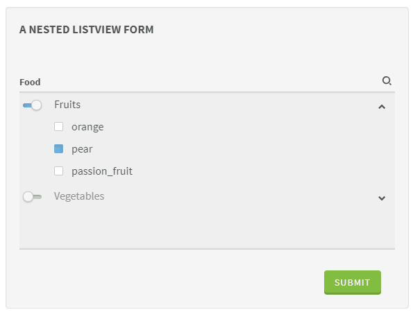

# NestedListView

This widget allows you to render a nested ListView to select multiple items with a 2 levels hierarchy.
More than 2 levels is currently not supported.

| Property | Type | Description |
|---|---|---|
| type | `object` | 
| properties | `object` | Every property of the value object (the key used in `properties` being the value's key)
| properties[key] | `object` | 
| properties[key].items | `object` | 
| properties[key].items.enum | `array` | The list of available values for this key of the value


```json
"food": {
  "type": "object",
  "properties": {
    "fruits": {
      "type": "array",
      "items": {
        "type": "string",
        "enum": ["orange", "pear", "passion_fruit"]
      }
    },
    "vegetables": {
      "type": "array",
      "items": {
        "type": "string",
        "enum": ["carot", "lettuce", "turnip"]
      }
    }
  }
}
```

**UI Schema**

| Property | Description | Default |
|---|---|---|
| key |  |  |
| title | The title to display in the ListView header |  |
| description | A description to display below the ListView |  |
| placeholder | The search input placeholder |  |
| widget | The widget to use | `nestedListView` |
| items | An array of sub values | 
| items[index].key | The sub value's key | 
| items[index].title | The sub value's title | 
| items[index].titleMap | The sub value's array mapping keys of JSON Schema enum with labels | 

```json
{
  "key": "food",
  "title": "Food",
  "widget": "nestedListView",
  "items": [
    {
      "key": "food.fruits",
      "title": "Fruits",
      "titleMap": {
        "orange": "Orange",
        "pear": "Pear",
        "passion_fruit": "Passion fruit"
      }
    },
    {
      "key": "food.vegetables",
      "title": "Vegetables",
      "titleMap": {
        "carot": "Carot",
        "lettuce": "Lettuce",
        "turnip": "Turnip"
      }
    }
  ]
}
```


