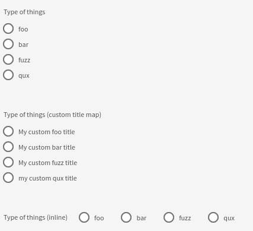

# Radios

This widget allows you to render radios input.

**Json Schema**

| Property | Description |
|---|---|
| type | `string` |
| enum | Possible values |

```json
{
  "type": "object",
  "title": "Choice",
  "properties": {
    "radios": {
      "type": "string",
      "enum": [
        "foo",
        "bar",
        "fuzz",
        "qux"
      ]
    },
    "withTitleMap": {
      "type": "string",
      "enum": [
        "foo",
        "bar",
        "fuzz",
        "qux"
      ]
    },
    "inline": {
      "type": "string",
      "enum": [
        "foo",
        "bar",
        "fuzz",
        "qux"
      ]
    }
  }
}
```

**UI Schema**

| Property | Description |
|---|---|
| widget | `radios` |
| title | The title to display above field |
| autoFocus | Default: `false` |
| disabled | Default: `false` |
| inline | Default: `false`. Display the radio on 1 line |
| titleMap | A mapping of value/label to display |

| Property | Description | Default |
|---|---|---|
| widget | `radios` |  |
| title | The title to display above field |  |
| autoFocus | Focus on input on render | `false` |
| disabled | Disable the input | `false` |
| inline | Display the radio on 1 line | `false` |
| titleMap | A mapping of value/label to display |  |
| hint | Configuration for tooltip with help information, that will be displayed when clicking on action icon (optional) | |
| hint.icon | icon name for action button (optional) | info-circle |
| hint.overlayComponent | component to display in tooltip content (JSX) | |
| hint.overlayPlacement | component placement relative to the action icon (optional) | right |

```json
[
  {
    "key": "radios",
    "title": "Type of things",
    "widget": "radios"
  },
  {
    "key": "withTitleMap",
    "title": "Type of things (custom title map)",
    "titleMap": {
      "foo": "My custom foo title",
      "bar": "My custom bar title",
      "fuzz": "My custom fuzz title",
      "qux": "my custom qux title"
    },
    "hint": {
      "icon": "my custom icon name",
      "overlayComponent": <span>My custom popover content</span>,
      "overlayPlacement": "My custom overlay placement"
    },
    "widget": "radios"
  },
  {
    "key": "inline",
    "title": "Type of things (inline)",
    "inline": true,
    "widget": "radios"
  }
]
```

**Result**


