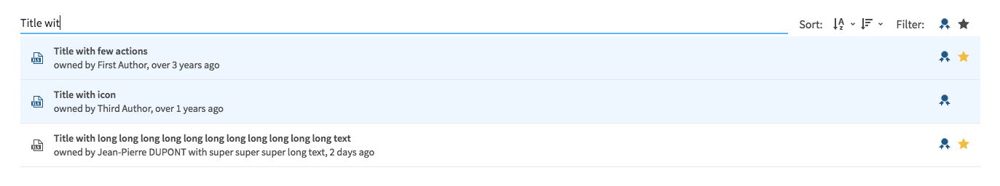

# ResourcePicker

This widget allows you to render a resource picker to select one or multiple resources.

**Json Schema**

| Property | Description |
|---|---|
| type | `string` |


```json
{
    "type": "object",
    "title": "ResourcePicker",
    "properties": {
      "multiResourcePicker": {
        "type": "enum",
        "enum": []
      },
      "singleResourcePicker": {
        "type": "enum",
        "enum": []
      }
    }
}
```

**UI Schema**

| Property | Description | Default |
|---|---|---|
| multi | Allow multiselection | `false` |
| title | The title to display next to the field |  |
| widget | The widget to use | `resourcePicker` |

```json
[
    {
      "key": "multiResourcePicker",
      "title": "ResourcePicker with multi selection",
      "widget": "resourcePicker",
      "placeholder": "Select an existing resource",
      "required": true,
      "multi": true
    },
  ]
```

**Result**


