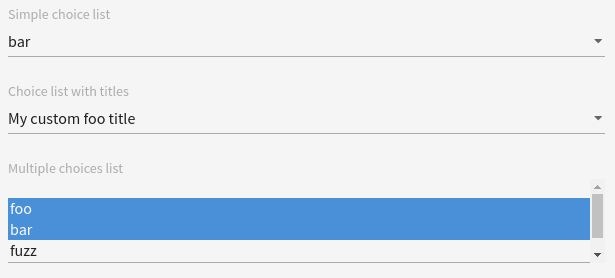

# Select

This widget allows you to render a select box input.

**Json Schema**

| Property of a single value | Description |
|---|---|
| type | `string` |
| enum | Possible values |

| Property of an array of value | Description |
|---|---|
| type | `array` |
| items.type | Type of the items |
| items.enum | Possible values |
| uniqueItems | Must be true, indicates that the items are unique in the array |

```json
{
  "type": "object",
  "title": "Arrays",
  "properties": {
    "simpleChoiceList": {
      "type": "string",
      "enum": [
        "foo",
        "bar",
        "fuzz",
        "qux"
      ]
    },
    "choiceListWithTitles": {
      "type": "string",
      "enum": [
        "foo",
        "bar",
        "fuzz",
        "qux"
      ]
    },
    "multipleChoicesList": {
      "type": "array",
      "items": {
        "type": "string",
        "enum": [
          "foo",
          "bar",
          "fuzz",
          "qux"
        ]
      },
      "uniqueItems": true
    }
  }
}
```

**UI Schema**

| Property | Description | Default |
|---|---|---|
| widget | `select`. It is mandatory for type array (the default array widget is checkboxes) |  |
| title | The title to display above field |  |
| autoFocus | Focus on input on render | `false` |
| disabled | Disable the input | `false` |
| readOnly | Set the input as non modifiable | `false` |
| titleMap | A mapping of value/label to display |  |

```json
[
  {
    "key": "simpleChoiceList",
    "title": "Simple choice list"
  },
  {
    "key": "choiceListWithTitles",
    "title": "Choice list with titles",
    "titleMap": {
      "foo": "My custom foo title",
      "bar": "My custom bar title",
      "fuzz": "My custom fuzz title",
      "qux": "my custom qux title"
    }
  },
  {
    "key": "multipleChoicesList",
    "title": "Multiple choices list",
    "widget": "select"
  }
]
```

**Result**


