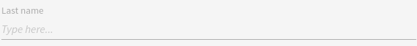
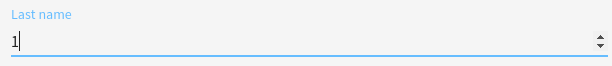

# Text

This widget allows you to render a text/number input.

**Json Schema**

| Property | Description |
|---|---|
| type | "string" or "number" |

```json
{
  "type": "object",
  "title": "Comment",
  "properties": {
    "lastname": {
      "type": "string"
    }
  }
}
```

**UI Schema**

| Property | Description |
|---|---|
| widget | Value : "text" (or undefined, because this is the default) |
| title | The title to display above field |
| autoFocus | Default: false |
| disabled | Default: false |
| placeholder | Text to display as placeholder |
| readOnly | Default: false |

```json
[
  {
    "key": "lastname",
    "widget": "text",
    "title": "Last name",
    "autoFocus": false,
    "disabled": false,
    "placeholder": "Type here...",
    "readOnly": false
  }
]
```

**Result**




