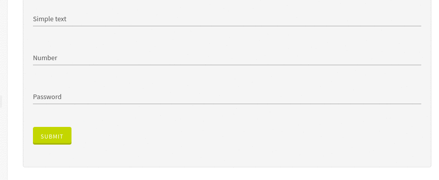
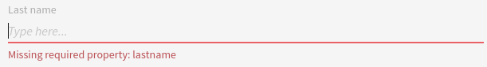

# Text

This widget allows you to render a text/number input.

**Json Schema**

| Property | Description |
|---|---|
| type | `string` or `number` |

```json
{
  "type": "object",
  "title": "Comment",
  "properties": {
    "lastname": {
      "type": "string"
    }
  }
}
```

**UI Schema**

| Property | Description | Default |
|---|---|---|
| widget | `text` | `text` |
| title | The title to display above field |  |
| hint | Configuration for tooltip with help information, that will be displayed when clicking on action icon (optional) | |
| hint.icon | icon name for action button (optional) | info-circle |
| hint.overlayComponent | component to display in tooltip content (JSX) | |
| hint.overlayPlacement | component placement relative to the action icon (optional) | right |
| type | The input type. You can for example pass `password` | The jsonSchema type |
| autoFocus | Focus on input on render | `false` |
| disabled | Disable the input | `false` |
| placeholder | Text to display as placeholder |  |
| readOnly | Set the input as non modifiable | `false` |

```json
[
  {
    "key": "lastname",
    "widget": "text",
    "title": "Last name",
    "hint": {
      "icon": "my custom icon name",
      "overlayComponent": <span>My custom popover content</span>,
      "overlayPlacement": "My custom overlay placement"
    },
    "autoFocus": false,
    "disabled": false,
    "placeholder": "Type here...",
    "readOnly": false
  }
]
```

**Result**



