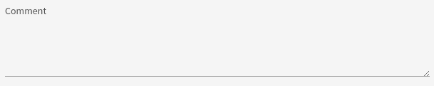

# TextArea

This widget allows you to render a textarea for a string field.

**Json Schema**
```json
{
  "type": "object",
  "title": "Comment",
  "properties": {
    "comment": {
      "type": "string"
    }
  }
}
```

**UI Schema**

| Property | Description | Default |
|---|---|---|
| widget | Value : `textarea` |  |
| title | The title to display above field |  |
| autoFocus | Focus on input on render | `false` |
| disabled | Disable the input | `false` |
| placeholder | Text to display as placeholder |  |
| readOnly | Set the input as non modifiable | `false` |
| rows | Number of rows |  |

```json
[
  {
    "key": "comment",
    "widget": "textarea",
    "title": "Comment",
    "autoFocus": false,
    "disabled": false,
    "placeholder": "Type here...",
    "readOnly": false,
    "rows": 5
  }
]
```

**Result**



