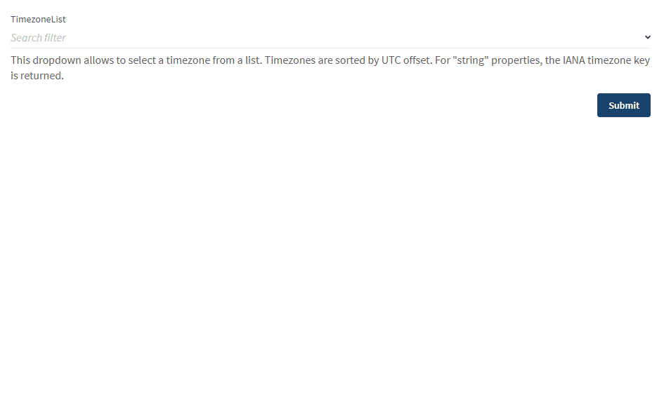

# TimezoneList

This widget can be used to provide a field to select a timezone (amongst IANA-listed timezones). Returned value is the standard name of the timezone ("Europe/Paris", "America/Los_Angeles" ...).

Technically, it's just a wrapper around [`Datalist` widget](../Datalist/README.md) that automatically feeds the available options.

## Json Schema

JSON schema is simple, the field only requires to be declared as a `string` value. No need to enumerate allowed values (this is managed by the widget).

```json
{
  "type": "object",
  "properties": {
    "timezone": {
      "type": "string"
    }
  }
}
```

## UI Schema

| Property | Description                                                            | Default |
|----------|------------------------------------------------------------------------|---------|
| ...      | Any config that should be forwarded to `Datalist` widget               | N/A     |
| lang     | The language timezones should be displayed in (`en`, `fr`, `de`, `ja`) | `en`    |

```json
[
    {
      "key": "timezone",
      "restricted": false,
      "title": "Timezone selection",
      "widget": "timezoneList",
      "lang": "fr"
    }
  ]
```

## Result


