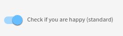

# Toggle

This widget allows you to render a toggle input.

**Json Schema**

```json
{
  "type": "object",
  "title": "Booleans",
  "properties": {
    "standard": {
      "type": "boolean"
   }
  }
}
```

**UI Schema**

| Property | Description | Default |
|---|---|---|
| widget | Value : `toggle` |  |
| title | The title to display beside the field |  |
| autoFocus | Focus on input on render | `false` |
| disabled | Disable the input | `false` |

```json
[
  {
    "key": "standard",
    "title": "Check if you are happy (standard)",
    "widget": "toggle"
  }
]
```

**Result**


