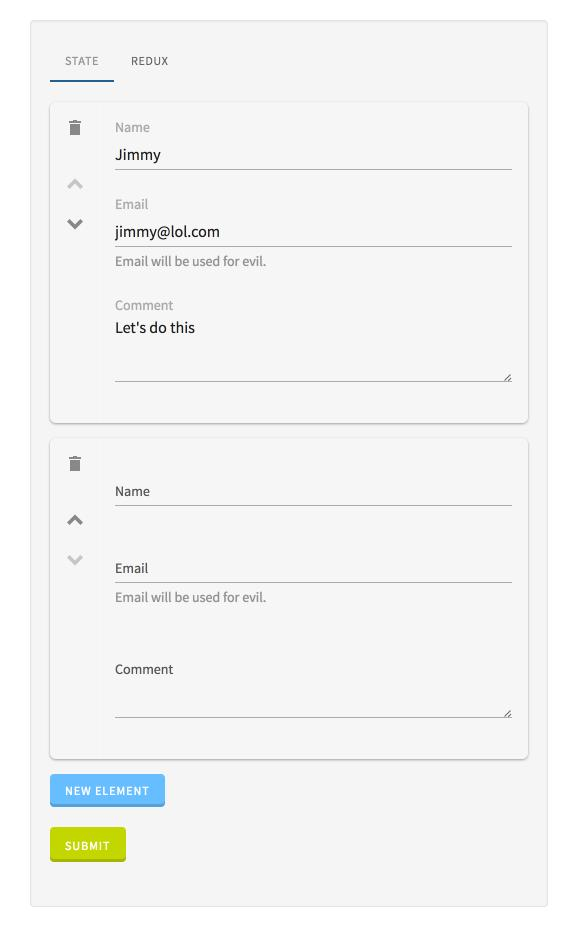

# Array

This widget allows you to create arrays of simple fields/widgets or objects

**Json Schema**

Array of simple strings

```json
{
  "type": "object",
  "title": "Comment",
  "required": [
    "comments"
  ],
  "properties": {
    "comments": {
      "type": "array",
      "items": {
        "type": "string"
      }
    }
  }
}
```


Array of objects { name, email, comment }

```json
{
  "type": "object",
  "title": "Comment",
  "required": [
    "comments"
  ],
  "properties": {
    "comments": {
      "type": "array",
      "items": {
        "type": "object",
        "properties": {
          "name": {
            "type": "string"
          },
          "email": {
            "type": "string",
            "pattern": "^\\S+@\\S+$"
          },
          "comment": {
            "type": "string",
            "maxLength": 20
          }
        },
        "required": [
          "name",
          "comment"
        ]
      }
    }
  }
}
```

**UI Schema**

| Property | Description | Default |
|---|---|---|
| reorder | An optional flag to enable/disable reorder. | `true` |
| itemWidget | An optional widget to render each item. | `fieldset` |
| items | An array of field/fieldset definitions that is included in each array object |  |

Array of simple strings

```json
["users"]
```

Array of objects

```json
[
  {
    "key": "comments",
    "items": [
      {
        "key": "comments[].name",
        "title": "Name"
      },
      {
        "key": "comments[].email",
        "title": "Email",
        "description": "Email will be used for evil."
      },
      {
        "key": "comments[].comment",
        "title": "Comment",
        "type": "textarea",
        "rows": 3,
        "validationMessage": "Don't be greedy!"
      }
    ]
  }
]
```

**Result**



**Custom Array template**

You can customize array template, by providing your template in UIForm `props.templates`.

Example:
```javascript
function CustomArrayTemplate(props) {
	const {
		canReorder,
		id,
		onAdd,
		onRemove,
		onReorder,
		renderItem,
		schema,
		value,
		options,
	} = props;

	return (
		<div>
			<legend>This is a custom array template</legend>
			<ol id={id} style={{ listStyle: 'none' }}>
				{value.map((itemValue, index) => {
					return (
						<li key={index}>
							<Action
							    icon={'talend-trash'}
							    label={'Remove'}
							    onClick={event => onReorder(event, index)}
							    hideLabel
							/>
							{canReorder && <Action
							    icon={'talend-caret-down'}
							    label={'Move Down'}
							    onClick={event => onReorder(event, { previousIndex: index, nextIndex: index - 1 }}
							    hideLabel
							/>}
							{renderItem(index)}
						</li>
					);
				})}
			</ol>
			<div>
				<button type="button" className="btn btn-info" onClick={onAdd}>
					New Element
				</button>
			</div>
		</div>
	);
}


const myTemplates = {
	array: MyCustomArrayTemplate,
};

<UIForm {...props} templates={myTemplates} />
```

Custom Array Template props

| Property | Type | Description |
|---|---|---|
| canReorder | `boolean` | Flag that indicates if reorder is enabled. |
| id | `string` | The widget id. |
| onAdd | `function` | `onAdd(event)` function to call to add an element. |
| onRemove | `function` | `onRemove(event, index)` function to call to remove an element. |
| onReorder | `function` | `onRemove(event, { previousIndex, nextIndex })` function to call to move an element. |
| renderItem | `function` | `renderItem(index)` function to call to render an element. |
| schema | `object` | The merged schema. |
| value | `any` | The array value. |
| options | `object` | If you want to pass some custom props you can pass them in this object and use inside the component. Currently only `btnLabel` option is supported, it changes label on button for adding new element
