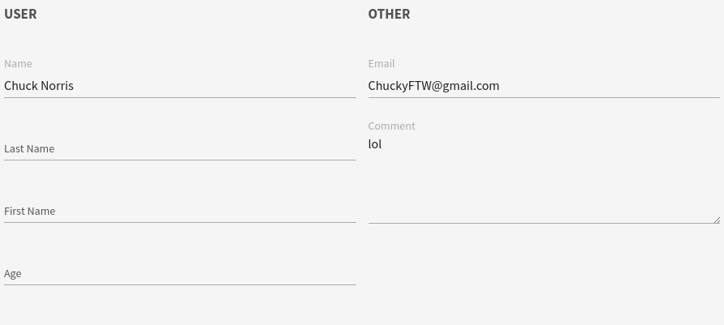

# Columns

This widget allows you to columns containing widgets/fields.

**Json Schema**

```json
{
  "type": "object",
  "title": "Comment",
  "properties": {
    "name": {
      "type": "string"
    },
    "lastname": {
      "type": "string"
    },
    "firstname": {
      "type": "string"
    },
    "age": {
      "type": "number"
    },
    "email": {
      "type": "string"
    },
    "comment": {
      "type": "string",
      "maxLength": 20
    }
  }
}
```

**UI Schema**

| Property | Description |
|---|---|
| widget | `columns` |
| items | An array of field/fieldset definitions |
| title | A title to set on top of the row of columns |

```json
[
  {
    "widget": "columns",
    "title": "My awesome columns",
    "items": [
      {
        "widget": "fieldset",
        "title": "User",
        "items": [
          {
            "key": "name",
            "title": "Name"
          },
          {
            "key": "lastname",
            "title": "Last Name"
          },
          {
            "key": "firstname",
            "title": "First Name"
          },
          {
            "key": "age",
            "title": "Age"
          }
        ]
      },
      {
        "widget": "fieldset",
        "title": "Other",
        "items": [
          {
            "key": "email",
            "title": "Email"
          },
          {
            "key": "comment",
            "widget": "textarea",
            "title": "Comment",
            "placeholder": "Make a comment"
          }
        ]
      }
    ]
  }
]
```

**Result**


