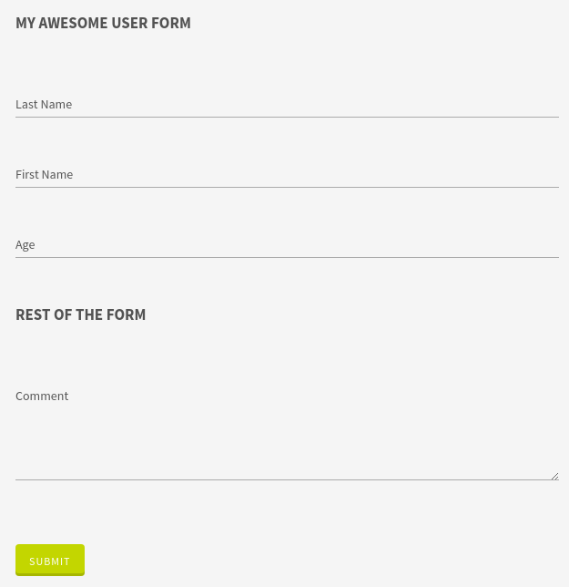

# Fieldset

This widget allows you to group your fields into fieldsets.

**Json Schema**
```json
{
  "type": "object",
  "title": "Comment",
  "properties": {
    "lastname": {
      "type": "string"
    },
    "firstname": {
      "type": "string"
    },
    "age": {
      "type": "number"
    },
    "comment": {
    "type": "string"
    }
  }
}
```

**UI Schema**

| Property | Description |
|---|---|
| widget | Value : `fieldset` |
| title | The title to display above fieldset |
| items | Array of widget definitions |

```json
[
  {
    "widget": "fieldset",
    "title": "My awesome USER form",
    "items": [
      {
        "key": "lastname",
        "title": "Last Name"
      },
      {
        "key": "firstname",
        "title": "First Name"
      },
      {
        "key": "age",
        "title": "Age"
      }
    ]
  },
  {
    "widget": "fieldset",
    "title": "Rest of the form",
    "items": [
      {
        "key": "comment",
        "widget": "textarea",
        "title": "Comment"
      }
    ]
  }
]
```

**Result**


