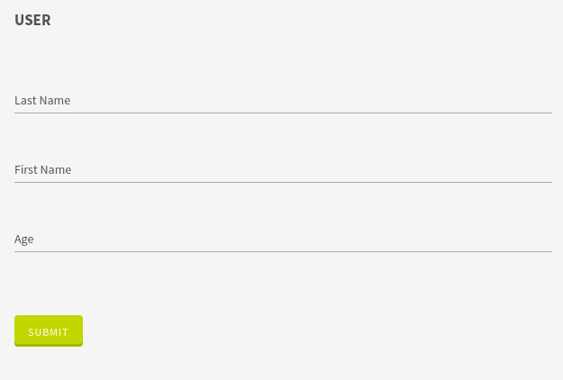
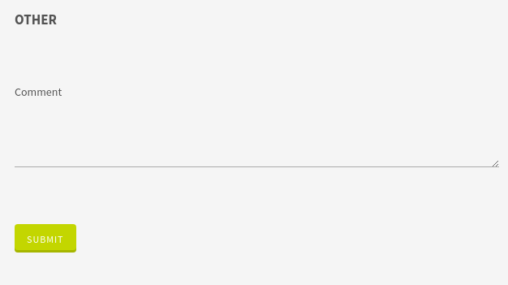

# Tabs

This widget allows you to group your fields into tabs.

**Json Schema**
```json
{
  "type": "object",
  "title": "Comment",
  "properties": {
    "lastname": {
      "type": "string"
    },
    "firstname": {
      "type": "string"
    },
    "age": {
      "type": "number"
    },
    "comment": {
      "type": "string"
    }
  }
}
```

**UI Schema**

| Property | Description |
|---|---|
| widget | Value : `tabs` |
| title | The title to display above fields and on the tab |
| items | Array of widget definitions |

```json
[
  {
    "widget": "tabs",
    "items": [
      {
        "title": "User",
        "items": [
          {
            "key": "lastname",
            "title": "Last Name"
          },
          {
            "key": "firstname",
            "title": "First Name"
          },
          {
            "key": "age",
            "title": "Age"
          }
        ]
      },
      {
        "title": "Other",
        "items": [
          {
            "key": "comment",
            "widget": "textarea",
            "title": "Comment"
          }
        ]
      }
    ]
  }
]
```

**Result**




