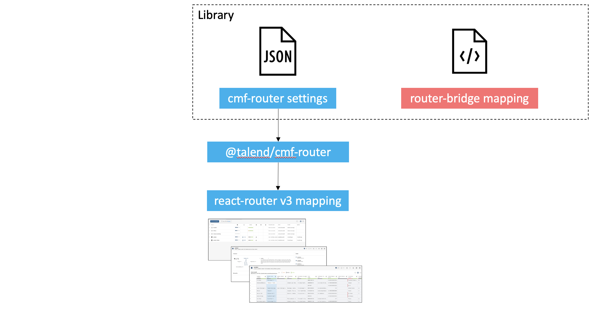
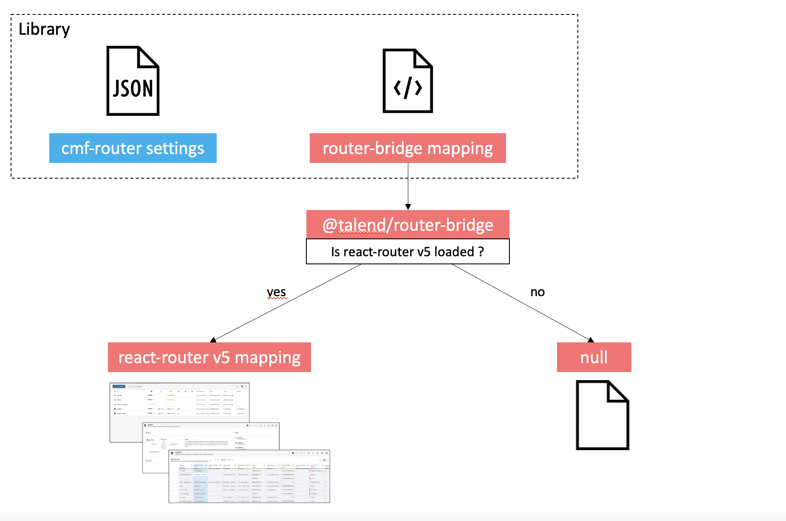
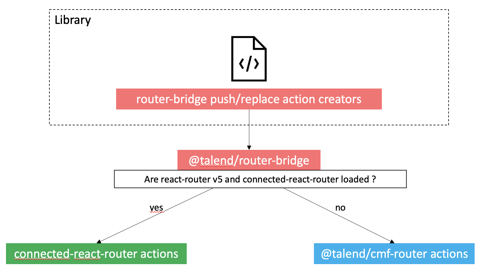

# @talend/router-bridge

This router-bridge aims to have a layer on top of router and redux connecter router actions. So libraries can support both cmf-router and future react-router v5 stack for
- route definitions
- redux action for redirection

# Router components

React-router v5 support nested route definitions, but not v3 used by cmf-router v3.  

The library need to duplicate the route mapping
- cmf-router: based on settings
- react-router v5: Route component

**CMF-router mode**


**React-router v5 mode**


`@talend/router-bridge` stays on top of `react-router-dom`. It serves react-router v5 components if it is loaded. Otherwise, nothing is rendered. So those route mapping can be used safely, they just won't set anything with `cmf-router`.

```javascript
import { Switch, Route } from '@talend/router-bridge';

export function Home() {
    return (
        <>
			<Route path="/datasets" component={DatasetList} />
			<Switch>
				<Route path="/datasets/add" component={AddDatasetForm} />
				<Route path="/dataset/:id" component={DatasetDetails} />
			</Switch>
		</>
    )
}
```

# Redux redirection action

`@talend/router-bridge` tries to stick to `connected-react-router` push/replace api. But with `cmf-router`, we need to pass a type, so we introduced a third argument, not available in `connected-react-router` functions.

| Argument          | Type   | Description                                                                                                                            |
| ----------------- | ------ | -------------------------------------------------------------------------------------------------------------------------------------- |
| url               | string | The url to redirect to.                                                                                                                |
| historyState?     | object | This state will be pushed to history state.                                                                                            |
| customBaseAction? | object | cmf-router doesn't put an action type. This can be used to set one. In cmf-router mode, this will be spread into the resulting action. |



The push/replace bridge will either 
- call `connected-react-router` push/replace if it is loaded
- create an action for `cmf-router` otherwise

```javascript
import { push, replace } from '@talend/router-bridge';

function redirectActionCreator() {
    return push('/home', null, { type: 'REDIRECT_TO_HOME' });
}
```
