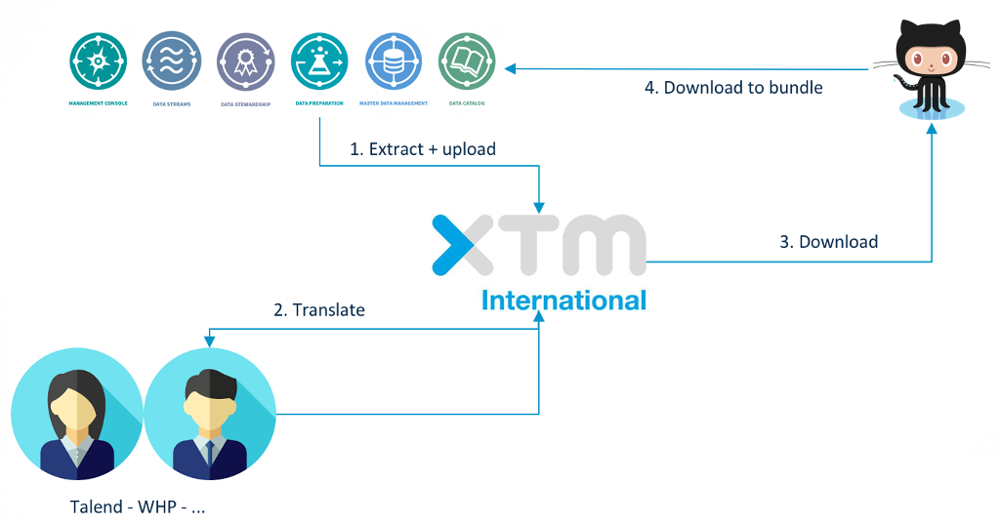

# Talend i18n scripts



The i18n process has multiple steps

1- Extract and upload

2- Translation within the cloud system

3- Download and versionning to github

4- Download translated files to the bundle


The talend-scripts module targets steps 1 - 2 - 3.

# Installation

```shell
yarn global install @talend/scripts
```

or

```shell
npm install -g @talend/scripts
```

Now the cli `talend-scripts` is available.

# Actions

There are 4 actions you can perform

```shell
talend-scripts i18n-extract
talend-scripts i18n-upload
talend-scripts i18n-download
talend-scripts i18n-to-github
```

# Configuration

The scripts are based on a `talend-scripts.json` configuration file at project root.

## Extract

This step will extract the i18n files from the project and create a zip.

All the files will be wrapped in a folder with your app extracted version.
The version (major.minor) is taken from files at project root.
* lerna.json
* pom.xml
* package.json


There are 4 methods of extraction
- npm : run an npm script
- yarn : same as npm but with yarn
- files : get the files from a list of path
- expression : get the files matching an expression, starting with a provided folder

*Npm/Yarn*

```json
{
  "extract": {
    "method": "npm",
    "script": "extract-i18n",
    "target": "./i18n",
    "transform": "flatten"
  }
}
```

| Configuration | Description |
|---|---|
| method | `npm` or `yarn` |
| script | The npm script name |
| target | The folder where the npm script will gather the translation files. This is used to create the zip file. |
| transform | Optional. Transformation to apply to file hierarchy. For now only `flatten` is accepted, putting all file directly under the target language folder. |

*Files*

```json
{
  "extract": {
    "method": "files",
    "files": ["./src/i18n/translation.json", "./src/app/other.json"],
    "target": "./i18n"
  }
}
```

| Configuration | Description |
|---|---|
| method | `npm` or `yarn` |
| files | The list of files to extract. |
| target | The folder where the script will gather the translation files. This is used to create the zip file. Note that the files folder hierarchy is preserved.  |

*Expression*

```json
{
  "extract": {
    "method": "expression",
    "rootPath": "./src",
    "expression": "message*.json",
    "target": "./i18n"
  }
}
```

| Configuration | Description |
|---|---|
| method | `expressionn` |
| rootPath | The folder to start the search. |
| expression | Expression describing the files name. You can use `*` as wildcard. `message*.json` means every files that start with `message` and end with `.json` (ex: message-errors.json, message.json, ...), whereas `message.json` matches only the `message.json` files. |
| target | The folder where the script will gather the translation files. This is used to create the zip file. Note that the files folder hierarchy is preserved.  |

## Upload/Download

You need to pass xtm information as environment variables

```shell
> API_URL=https://XXX \
  CLIENT=YYY \
  CUSTOMER_ID=ZZZ \
  USER_ID=AAA \
  PASSWORD=BBB \
  talend-scripts <i18n-upload|i18n-download>
```

| Variable | Description |
|---|---|
| API_URL | The XTM api url |
| CLIENT | The XTM client name |
| CUSTOMER_ID | The XTM customer ID |
| USER_ID | The XTM user id used to log in |
| PASSWORD | The XTM user password to log in |

### Upload
This step will upload previously created i18n zip to XTM.

```json
{
  "load": {
    "project": "UI"
  }
}
```

| Configuration | Description |
|---|---|
| project | The XTM project name. |


### Download
This step will download, unzip and transform files from XTM.

```json
{
  "load": {
    "project": "UI",
    "target": "./i18n-from-xtm"
  }
}
```

| Configuration | Description |
|---|---|
| project | The XTM project name. |
| target | The folder where the files will be download, unzipped, and transformed. |

It will download only the files corresponding to the current version of your project (version extracted). If no version is detected, all versions will be downloaded.


### To Github
This step will push downloaded i18n files to github.

You need to pass github credentials as environment variables.

```shell
> GITHUB_LOGIN=XXX \
  GITHUB_TOKEN=YYY \
  talend-scripts i18n-extract
```

| Variable | Description |
|---|---|
| GITHUB_LOGIN | Github username that will be used to push to the locales repo |
| GITHUB_TOKEN | Github token |


`talend-i18n.json` configuration

```json
{
  "github": {
    "url": "https://github.com/Talend/locales.git"
  }
}
```

| Configuration | Description |
|---|---|
| url | The https git url. |

The i18n files will be pushed to a branch `{XTM_project}/{version}`.

With this branch structure, the locales for your project can be downloaded from a defined url.
```
https://github.com/{github_org}/{repo_name}/archive/{XTM_project}/{version}.zip
```

In the example :
```
https://github.com/Talend/locales/archive/UI/1.10.zip
```
